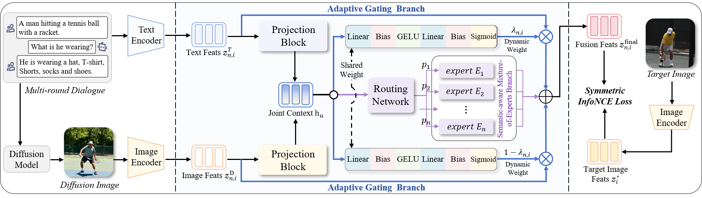

<h1 align="center">
🧠ADaFuSE: Adaptive Diffusion-generated Image and Text Fusion for Interactive Text-to-Image Retrieval</h1>

<p align = "center">

</p>


* **Official PyTorch implementation for paper:  "ADaFuSE: Adaptive Diffusion-generated Image and Text Fusion
for Interactive Text-to-Image Retrieval "** <br>

## 📰 Updates
- [2026/02/14] The code of ADaFuSE is released! 🎉

## 🗞️ Table of Contentsk
- [Setup](#-setup)
- [Download Pretrained Weights](#-download-the-beit-3-pretrain-weight-for-retrieval-task)
- [Data Preparation](#-data-preparation)
- [Download Checkpoints](#-download-our-checkpoints)
- [Training and Evaluation](#-training-and-evaluation)
- [Acknowledgements](#-acknowledgements)
- [License](#-license)
- [Citation](#-citation)

## 🛠️ Setup
First, clone this repository to your local machine, and install the dependencies.
```bash
pip install -r requirements.txt
```
❗ You can modify the PyTorch version to suit your machine.

## ⬇️ Download The BLIP
   Please install the [BLIP repository](https://github.com/salesforce/BLIP) as a sub folder.

## 💾 Data Preparation
Please download the required datasets from the following sources:
   - [`DAI-TIR Dataset`](https://drive.google.com/drive/folders/1JhXEoeiuwKNsVlm6LdJXFcbxYMcaJTw6?usp=sharing): 
   - [`ChatIR Benchmark`](https://github.com/levymsn/ChatIR?tab=readme-ov-file#table-of-contents): Four eval benchmark diglogue dataset with diverse dialogue styles (e.g., ChatGPT, Human).

## 🗂️ Download our checkpoints
The checkpoints will be made publicly available upon acceptance of the paper.

## 🚀 Training and Evaluation

###  Directory Structure

To ensure the code runs correctly, you can organize your project directory as follows. Alternatively, you can modify the paths in `dmcl_config.py` to match your custom directory structure.

```text
.
├── blip_models/                # Store pretrained BLIP weights here
├── dataset/                    # Dataset root
│   ├── visdial_1.0_train_sum_all.json
│   ├── query_images/           # Generated images for training (DA-VisDial)
│   │   ├── train-xxxx_0.jpg
│   │   └── ...
├── ChatIR_Protocol/            # Validation Corpus
│   └── Search_Space_val_50k.json
├── dialogues/                  # Validation Queries
│   └── VD-reformulated.json
├── data/
│   └── generated_images/       # Validation generated images
├── blip_config.py              # Main configuration file
├── train_adafuse.py            # Main training & evaluation script
├── adafuse.py                 # ADaFuSE (Combiner) Model Implementation
├── local_blip_model.py         # BLIP Model Wrapper
├── my_dataset.py               # Dataset Loaders
├── blip_optim_factory.py       # Optimizer & Layer-wise LR decay
└── ...
```

### Training
You can adjust the training hyperparameters by passing command-line arguments. Alternatively, you can configure them directly by modifying dmcl_config.py, allowing you to simply run:
```bash
python train_adafuse.py
```

### Evaluation
To perform a complete evaluation of the experiment, run the following command:
```bash
python eval_adafuse.py
```

## 🤝 Acknowledgements

Our code is built upon the excellent work of [BLIP](https://github.com/salesforce/BLIP). We thank the authors for their open-source contribution.

We also express our gratitude to the following projects for providing datasets and evaluation protocols:
* [VisDial v1.0](https://visualdialog.org/) for the visual dialogue dataset.
* [ChatIR](https://github.com/levymsn/ChatIR) for the interactive text-to-image benchmarks and baselines.

## ⚖️ License

This project is licensed under the **MIT License**. See the [LICENSE](LICENSE) file for details.

## ✏️ Citation

If you find this code useful for your research, please consider citing our paper:


